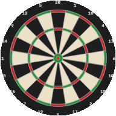
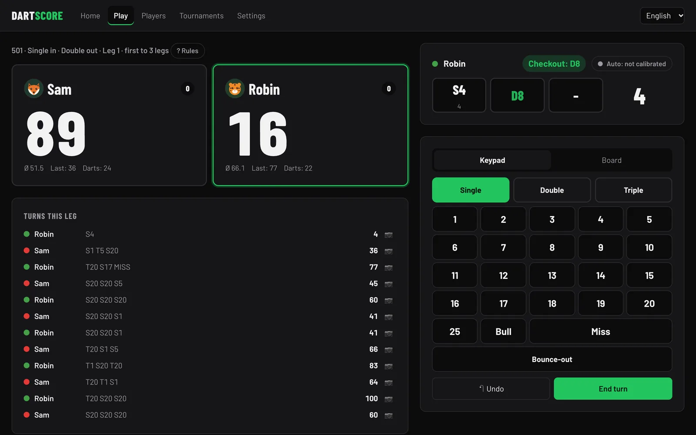
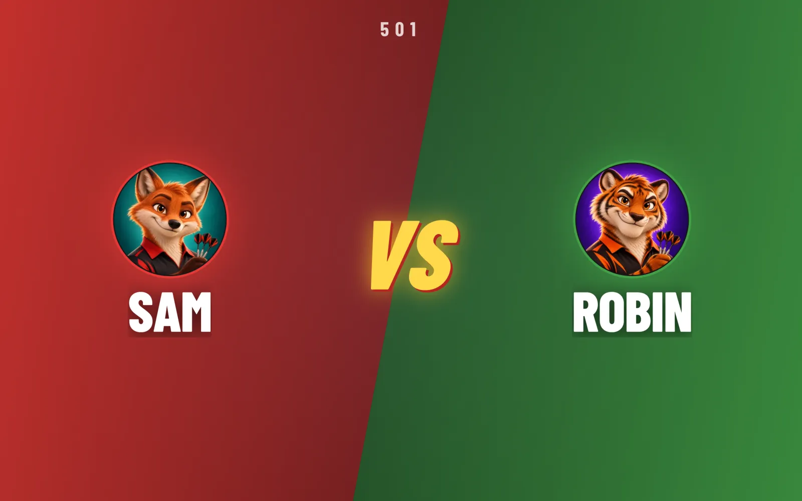
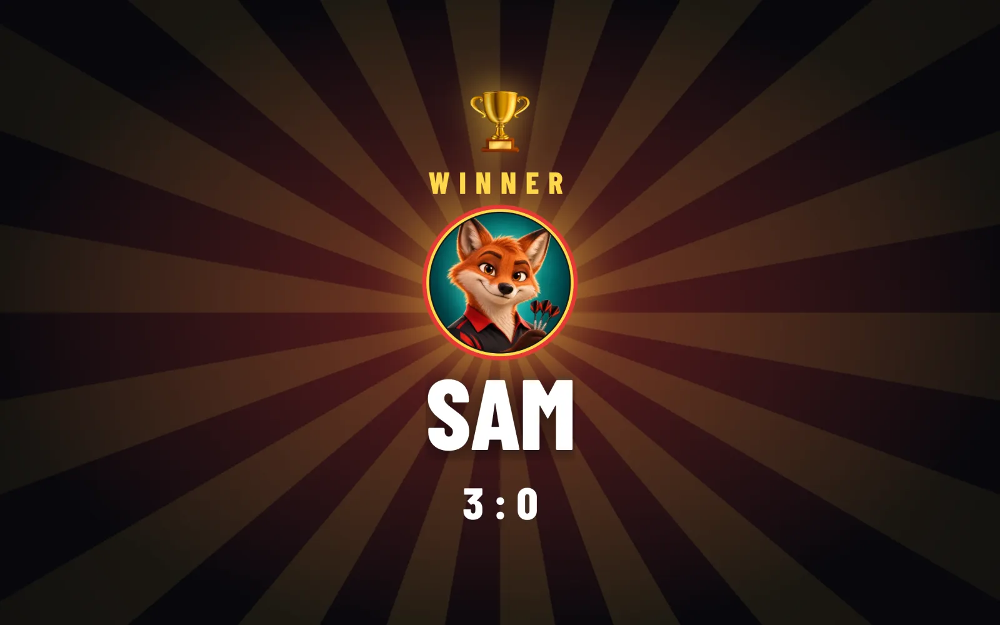
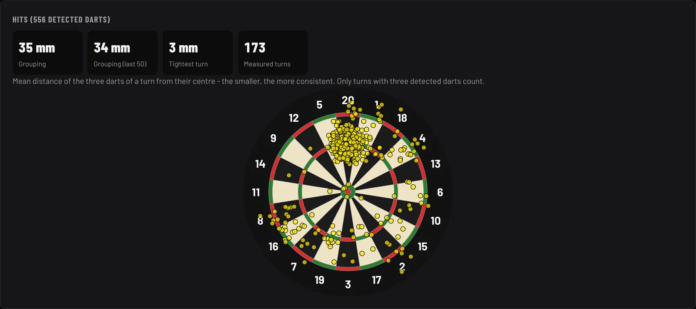
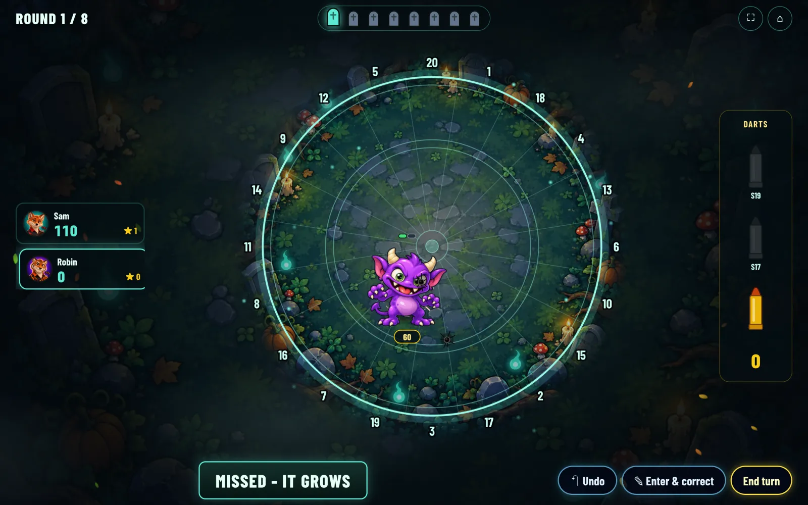
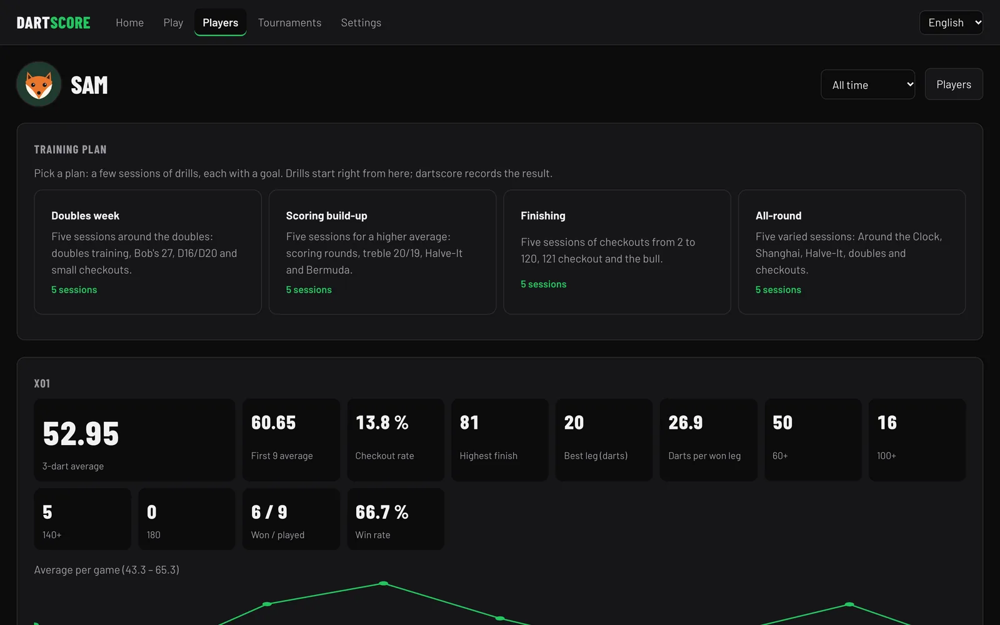
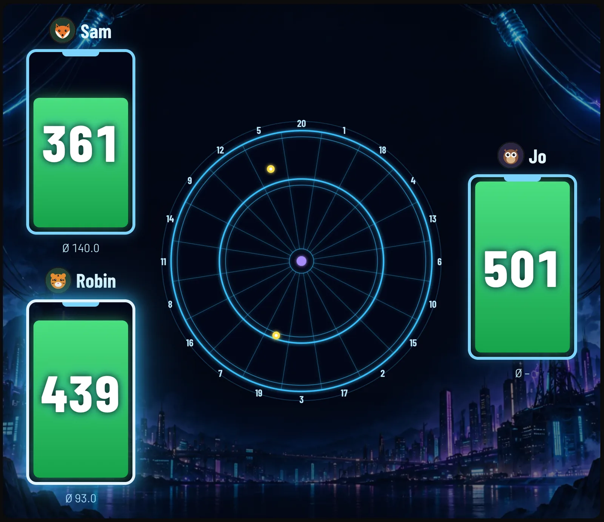

<p align="center">
  
</p>

<h1 align="center">dartscore</h1>

<p align="center">
  <b>Offline auto-scoring for steel-tip darts.</b><br>
  Three cameras, a trained dart-tip model and a browser UI for TV, tablet and phone –<br>
  no cloud, no account, all stats stay in your home network.
</p>

<p align="center">
  <a href="https://abartholomaei.github.io/dartscore/"></a>
  <a href="https://github.com/abartholomaei/dartscore/releases/latest"></a>
  
  
  
  
  
  
</p>

<p align="center">
  
</p>

## Highlights

| | |
| --- | --- |
| 🎯 **Automatic scoring** | Motion trigger, YOLO pose tip model and classic CV fallback, fused across 3 cameras; unsure darts get a second look by the referee. 97 % correct segments on real recorded throws. |
| 🔄 **Hands-free turns** | Pulling the darts ends the turn; corrections take two taps on the keypad or the board, bounce-outs included. |
| 🎮 **20+ games and variants** | X01 (in/out rules, legs & sets, handicap, teams), Cricket (standard, cut-throat, no-score, random, hidden), training modes from Around the Clock to 121 checkout, Killer, Halve-It, Gotcha, local tournaments, bots. |
| 📊 **Statistics** | Averages, checkout rate, ton counts, MPR, heatmap, grouping, aim deviation, trends for every mode, achievements; CSV/JSON export and daily backups. |
| 🧑‍🤝‍🧑 **Local profiles** | A photo or one of 16 cartoon portraits (bots wear robot versions), favourite double, optional PIN, training plans, a personal bot that throws like you. |
| 🏆 **Showtime** | Versus screen before the first dart, line-up and "up next" intros for bigger rounds, a full-screen winner reveal at the end. |
| 👾 **Arcade** | Full-screen monster hunt and Fruit Samurai on the real dart positions and the X01 Voltage theme, with animations and particle effects. |
| 📺 **Any screen** | Responsive, installable web app; readable from the oche on a TV, QR code to open it on a phone. |
| 🔒 **Local first** | FastAPI + SQLite on a small PC (reference: 2012 Mac mini, CPU inference); works without internet. |

<table>
  <tr>
    <td width="50%"></td>
    <td width="50%"></td>
  </tr>
  <tr>
    <td width="50%"></td>
    <td width="50%"></td>
  </tr>
  <tr>
    <td width="50%"></td>
    <td width="50%"></td>
  </tr>
</table>

<sub>Screenshots show demo data. The full feature tour is on the <a href="https://abartholomaei.github.io/dartscore/">project page</a>; requirements and roadmap are in <a href="docs/PRD.md">docs/PRD.md</a> (German), camera setup in <a href="docs/hardware-setup.md">docs/hardware-setup.md</a>.</sub>

## Installation

Ready-to-run builds for Windows, macOS (Apple Silicon) and Linux (x86_64, ARM64) are on the [releases page](https://github.com/abartholomaei/dartscore/releases/latest). They need neither Python nor Node.js and add a shortcut that starts the server and opens the UI in the browser.

| System | Guide |
| --- | --- |
| Windows 10/11 | [docs/install/windows.md](docs/install/windows.md) – setup `.exe` with Start menu and desktop shortcut |
| macOS 14+ | [docs/install/macos.md](docs/install/macos.md) – `dartscore.app` via the install script |
| Linux (Debian, Ubuntu, Raspberry Pi OS) | [docs/install/linux.md](docs/install/linux.md) – app menu and desktop shortcut, optional autostart service |

On Linux and macOS, one line installs the latest release:

```bash
curl -fsSL https://github.com/abartholomaei/dartscore/releases/latest/download/install.sh | sh
```

How releases are made: [docs/releasing.md](docs/releasing.md). To develop or to run from source, read on.

## Structure

| Folder | Contents |
| --- | --- |
| `backend/` | Python package `dartscore`: FastAPI server, game logic (`game`), detection (`vision`), persistence (`storage`) |
| `frontend/` | Web UI (React + TypeScript + Vite), responsive for phone, tablet, desktop and TV |
| `docs/` | PRD, hardware notes, installation guides (`docs/install`) and the project page (`docs/site`, published with `make pages`) |
| `packaging/` | Release builds: PyInstaller spec, installers, shortcuts (`make package`) |
| `config.example.toml` | Example configuration (server, cameras, logging) |

## Requirements

- [uv](https://docs.astral.sh/uv/) (installs Python 3.12 automatically)
- Node.js ≥ 20 with npm
- `make`

## Setup

```bash
make install
cp config.example.toml config.toml
make hooks
```

`make hooks` installs the Git hooks that format, lint and type-check before every commit.

## Development

Start backend and frontend in two terminals:

```bash
make dev-backend
```

```bash
make dev-frontend
```

The UI then runs on http://localhost:5173 and proxies `/api` and `/ws` to the backend on port 8000. Other devices on the home network reach it via the computer's IP.

## Production

Build the frontend once; the backend then serves it on port 8000 (no Node.js needed on the target machine):

```bash
cd frontend && npm run build
```

```bash
make dev-backend
```

The UI is then available at http://<host>:8000.

To run it as a service, see [deploy/dartscore.service](deploy/dartscore.service). It conflicts with Autodarts, so starting one stops the other.

## UI languages

The web UI is available in English and German; the language follows the browser and can be switched in the header. Strings live in `frontend/src/i18n/locales/` (`en.ts` is the source of truth, other locales are type-checked against it). To add a language, create a new locale file and register it in `frontend/src/i18n/index.ts`.

## Checks

```bash
make check
```

Runs lint, type checking, tests and the frontend build.

## Configuration

The configuration is looked up in this order: `--config <path>`, environment variable `DARTSCORE_CONFIG`, `./config.toml`. Individual values can be overridden via environment variables, nested keys with `__`:

```bash
DARTSCORE_SERVER__PORT=9000 DARTSCORE_LOGGING__LEVEL=DEBUG make dev-backend
```

With `logging.json_output = true` the server writes JSON logs, e.g. when running as a systemd service.

## License

[MIT](LICENSE)
