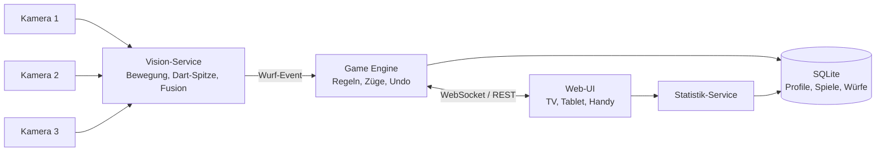

# PRD – Lokales Auto-Scoring Dartsystem

Stand: 2026-09-26

**Getroffene Entscheidungen**

| Thema | Entscheidung |
| --- | --- |
| Kameras | 3× OV9732-Kameramodul (1280×720, 30 fps, 100° FOV, Fixfokus, USB 2.0), als Autodarts-kompatibles Set gekauft ([Amazon](https://www.amazon.de/dp/B0DYJW1S1N)) |
| Oberfläche | Läuft im Browser wie bei Autodarts, responsive (Handy, Tablet, Desktop, TV) |
| Erkennung | Trainiertes Deep-Learning-Modell (Keypoint-/Objekterkennung), klassische Bildverarbeitung nur als Unterstützung |
| Zielrechner | Mac mini (Late 2012), i7-3615QM (Ivy Bridge, 4C/8T, AVX, kein AVX2), 16 GB RAM, Debian 12. Inferenz auf der CPU (HD 4000 von OpenVINO nicht unterstützt). Autodarts läuft darauf problemlos. Details: [hardware-setup.md](hardware-setup.md) |
| Plattform | Universell: läuft auf Linux x86_64 und ARM64 (Raspberry Pi 5), nativ auch auf macOS und Windows; Hardware-Beschleunigung wird automatisch erkannt |

---

## 1. Überblick & Vision

Ziel ist ein selbst gebautes, rein lokales Auto-Scoring-System für eine Steeldartscheibe mit drei Kameras – funktional nah an Autodarts, aber ohne Cloud, Account oder Online-Spiel.

Das System erkennt jeden geworfenen Dart automatisch, ordnet ihn einem Segment zu (z. B. T20, D16, Bull), führt das laufende Spiel und speichert alle Würfe pro lokalem Spielerprofil. Daraus entstehen Statistiken wie 3-Dart-Average, Checkout-Quote oder Trefferbilder.

**Abgrenzung zu Autodarts:**

- Kein Online-Matchmaking, keine Lobbys, keine Cloud-Synchronisation
- Alle Daten liegen lokal (Rechner im Heimnetz); Bedienung über Browser, Tablet oder Handy im selben WLAN
- Fokus auf Heimgebrauch: mehrere Profile, Gäste, Trainingsspiele und Statistiken
- Eigene Erkennungs-Pipeline (Computer Vision), offen erweiterbar

---

## 2. Ziele, Nicht-Ziele und Erfolgskriterien

Das Produkt ist erfolgreich, wenn man ein komplettes 501-Leg spielen kann, ohne einen einzigen Wurf manuell korrigieren zu müssen.

**Ziele**

- Automatische Erkennung von Treffern, Fehlwürfen (außerhalb Doppelring) und Bouncern
- Automatische Erkennung „Darts gezogen“ → nächster Spieler
- Die gängigen Spielmodi (X01, Cricket, Training, Party)
- Beliebig viele lokale Profile mit dauerhafter Statistik
- Einfache manuelle Korrektur, falls die Erkennung irrt

**Nicht-Ziele (vorerst)**

- Online-Spiel, Accounts, Cloud-Backup, Ranglisten im Internet
- Softtip-/E-Dart-Scheiben
- Native Mobile Apps (Browser-UI / PWA reicht)
- Kommerzieller Vertrieb

**Erfolgskriterien**

| Kriterium | Zielwert |
| --- | --- |
| Segment-Erkennungsgenauigkeit (korrektes Feld inkl. Multiplikator) | ≥ 98 % (MVP ≥ 95 %) |
| Latenz Einschlag → Anzeige | ≤ 500 ms |
| Erkennung „Darts gezogen“ | ≥ 99 %, ≤ 1 s |
| Fehlalarme (Wurf erkannt, obwohl keiner erfolgte) | < 1 pro 100 Würfe |
| Kalibrierung neu einrichten | ≤ 5 Minuten, geführt |
| Manuelle Korrektur eines Wurfs | ≤ 2 Klicks/Taps |

---

## 3. Hardware-Setup

Die drei Kameras sind bereits vorhanden; sie werden im Abstand von ca. 120° um die Scheibe montiert und blicken flach (seitlich) auf die Scheibenoberfläche.

| Komponente | Anforderung / Annahme |
| --- | --- |
| Dartscheibe | Steeldart, Standardmaße (Bull 12,7 mm, Doppel-/Triple-Ring 8 mm), fest montiert |
| Kameras (3×) | OV9732-Modul: 1280×720, 30 fps, 100° Weitwinkel, Fixfokus, USB 2.0 (UVC), 2 m Kabel. Weitwinkel → Linsenentzerrung nötig; MJPEG-Unterstützung noch prüfen |
| Montage | Ring oder Surround mit 3 Halterungen, ca. 120° versetzt, Kameras knapp vor der Scheibenebene |
| Beleuchtung | LED-Ring, gleichmäßig, schattenarm, flimmerfrei (wichtig für stabile Differenzbilder) |
| Rechner | Referenz: Mac mini (i7-3615QM, 16 GB, Debian 12), Inferenz auf der CPU (OpenVINO oder ONNX Runtime); teilt sich den Rechner mit Home Assistant und Autodarts. Ebenfalls unterstützt: andere x86-PCs, NVIDIA-GPU (CUDA/TensorRT), Apple Silicon (CoreML), Raspberry Pi 5 (CPU, optional Hailo-Beschleuniger) |
| USB | Gemessen: 3× MJPG 1280x720 an einem USB-2.0-Hub mit je 29,5 fps – ausreichend. Voraussetzung: `exposure_dynamic_framerate=0` |
| Anzeige | Browser auf TV, Tablet oder Handy im Heimnetz |
| Optional | Mikrofon/Piezo als Einschlag-Trigger, Lautsprecher für Caller-Ansagen |

Offen: Montageart (Surround/Ring) und welche Kamera an welcher Position hängt (Testbilder waren wegen fehlender Beleuchtung schwarz).

---

## 4. Systemarchitektur & Tech-Stack

Empfehlung: ein Python-Backend für Kamera + Erkennungsmodell + Spiellogik, eine responsive Web-UI im Browser (wie Autodarts), verbunden per WebSocket, Daten in SQLite.

| Schicht | Empfehlung | Alternative |
| --- | --- | --- |
| Erkennung | Ultralytics YOLO (Pose/Keypoint-Variante) für Dart-Spitzen, Export nach ONNX; Inferenz mit ONNX Runtime/CoreML/TensorRT; OpenCV für Kameras, Entzerrung, Bewegungstrigger | Eigenes Keypoint-Netz (z. B. RTMPose) |
| Training | PyTorch + Ultralytics, Labeling mit Label Studio oder CVAT | Roboflow (Cloud, nur fürs Labeling) |
| Backend / API | FastAPI (REST + WebSocket) | Node.js |
| Spiellogik | Reines Python-Modul, voll unit-getestet, UI-unabhängig | – |
| Datenbank | SQLite + SQLModel/SQLAlchemy, Migrationen mit Alembic | PostgreSQL |
| Frontend | React + TypeScript (Vite), responsive (Mobile-first), PWA-fähig, Touch-optimiert | Svelte |
| Packaging | Docker-Image für linux/amd64 + linux/arm64 (Kameras per `/dev/video*` durchgereicht) und alternativ native Installation per `pipx`/Installskript + systemd-Dienst. Auf macOS/Windows nur nativ, da Docker dort keinen USB-Kamerazugriff hat | – |

**Erkennungs-Pipeline (hybrid: Modell + klassische CV):**

1. Bewegungstrigger per Differenzbild (günstig, läuft dauerhaft) → „etwas ist passiert“
2. Stabilisierung abwarten (Dart steckt, keine Bewegung mehr)
3. Entzerrtes Bild jeder Kamera ans Modell: erkennt Dart-Spitzen (Keypoints) und ggf. Board-Kalibrierpunkte
4. Pro Kamera: Spitzen-Position → Position auf der Scheibenebene via Homographie
5. Fusion der 3 Kameras (gewichteter Mittelwert nach Modell-Konfidenz, Ausreißer verwerfen)
6. Abgleich mit den bereits steckenden Darts → nur der neue Dart zählt
7. Koordinate (Polar: Radius, Winkel) → Segment + Multiplikator
8. Hand im Bild / alle Darts entfernt → Zug-Ende erkennen

**Stand fertiger Modelle (recherchiert 2026-09-26):**

| Projekt | Was es ist | Für uns nutzbar? |
| --- | --- | --- |
| [DeepDarts](https://github.com/wmcnally/deep-darts) ([Paper](https://arxiv.org/abs/2105.09880)) | YOLOv4-tiny, erkennt Dart-Spitzen + 4 Kalibrierpunkte aus einem Bild, ca. 16.000 gelabelte Bilder, Gewichte und Datensatz auf IEEE Dataport; TensorFlow 2, alter Stack (Python ≤ 3.8) | Datensatz ja (Vortraining), Modell nicht direkt: trainiert auf Frontalansicht, nicht auf flach-seitliche Kameras |
| [deeper_darts](https://github.com/robustRobot23/deeper_darts) | Trainings-Setup für YOLOv8n auf dem DeepDarts-Datensatz | Gute Vorlage für die Trainings-Pipeline; keine fertigen Gewichte |
| [SmartDart](https://github.com/Nick-Hageman/SmartDart), [Dart-Detection-with-YOLO](https://github.com/uthadatnakul-s/Dart-Detection-and-Scoring-with-YOLO) | Einzelprojekte mit eigenem YOLO-Training | Nur als Ideengeber |
| Autodarts | Eigenes Modell für genau dieses 3-Kamera-Setup | Nein, proprietär und nicht verfügbar |

**Inferenz auf schwacher Hardware (Referenz: alter Intel Mac mini)**

Ein kleines YOLO-Pose-Modell braucht auf einer älteren Intel-CPU grob 50–150 ms pro Bild (Schätzung, wird in M2b gemessen). Bei 3 Kameras reicht das nur, wenn nicht dauerhaft gerechnet wird:

- Modell läuft nur nach dem Bewegungstrigger, nicht auf jedem Frame
- Nur der Bildausschnitt um die Scheibe (ROI) geht ans Modell, kleinere Eingabegröße (z. B. 416–480 px statt 640)
- Kleinste Modellgröße (n), INT8-Quantisierung mit OpenVINO
- Die 3 Kamerabilder parallel oder als Batch verarbeiten
- Backend-Auswahl automatisch: OpenVINO (Intel) → CUDA/TensorRT (NVIDIA) → CoreML (Apple) → CPU (ONNX Runtime) als universeller Fallback

**Training** läuft nicht auf dem Mac mini, sondern einmalig auf einem Rechner mit GPU oder in einem Cloud-Notebook (z. B. Google Colab). Heraus kommt eine ONNX-Datei, die lokal auf dem Mac mini läuft. Der Spielbetrieb bleibt komplett offline.

**Konsequenz:** Es gibt kein fertiges Modell für ein seitliches 3-Kamera-Setup. Der Plan:

1. Modell (YOLO-Pose) mit dem DeepDarts-Datensatz vortrainieren
2. Mit eigenen Aufnahmen der eigenen Scheibe nachtrainieren (Fine-Tuning); Ziel zunächst 2.000–5.000 gelabelte Kamerabilder
3. Labeling beschleunigen: Wurfposition wird im Spiel ohnehin bestätigt oder korrigiert → jede Session erzeugt automatisch neue Trainingsdaten (Selbstverbesserung)
4. Bis das Modell gut genug ist: klassische Spitzenerkennung per Differenzbild als Übergangslösung und zum Vorlabeln

---

## 5. Funktionale Anforderungen

Priorität: **M** = Must (MVP), **S** = Should, **C** = Could.

### 5.1 Wurferkennung

| ID | Anforderung | Prio |
| --- | --- | --- |
| E-1 | Treffer automatisch erkennen und als Segment + Multiplikator melden (S, D, T, 25, 50) | M |
| E-2 | Bis zu 3 Darts pro Aufnahme unterscheiden, auch bei Verdeckung durch vorherige Darts | M |
| E-3 | Miss (außerhalb Doppelring) erkennen | M |
| E-4 | „Darts gezogen“ erkennen → Zugwechsel | M |
| E-5 | Bouncer / herausgefallene Darts erkennen oder als manuelle Eingabe anbieten | S |
| E-6 | Konfidenzwert je Wurf; bei niedriger Konfidenz Nachfrage in der UI | S |
| E-7 | Robuste Erkennung bei wechselndem Umgebungslicht | S |
| E-8 | Degradierter Betrieb mit nur 2 Kameras | S |
| E-9 | Aufzeichnung von Rohbildern pro Wurf zur Fehleranalyse / Training | S |
| E-10 | Trainiertes Modell (Dart-Spitzen-Keypoints) als primäre Erkennung | M |
| E-11 | Klassische CV-Spitzenerkennung als Übergangslösung und Fallback | S |
| E-12 | Bestätigte/korrigierte Würfe automatisch als Trainingsdaten speichern | S |

### 5.2 Kalibrierung & Board-Management

| ID | Anforderung | Prio |
| --- | --- | --- |
| K-1 | Live-Kamerabild aller 3 Kameras in der UI | M |
| K-2 | Geführte Kalibrierung: Referenzpunkte (z. B. Schnittpunkte Doppelring/Segmentgrenzen) je Kamera setzen → Homographie | M |
| K-3 | Automatische Kalibrierung per Segmentlinien-Erkennung | S |
| K-4 | Overlay des erkannten Board-Rasters auf jedem Kamerabild zur Kontrolle | M |
| K-5 | Kalibrierung speichern/laden, Warnung bei verschobenem Board/Kamera | S |
| K-6 | Kameraeinstellungen (Auflösung, fps, Belichtung, Fokus) je Kamera | M |
| K-7 | Test-Modus: Dart stecken → erkanntes Feld anzeigen, ohne Spiel | M |
| K-8 | Board-Rotation einstellbar (20 oben) | M |

### 5.3 Spielmodi

| Modus | Varianten / Optionen | Prio |
| --- | --- | --- |
| X01 | 301/501/701/901; Single/Double/Master-In & -Out; Legs & Sets; Bust-Regel | M |
| Cricket | Standard, Cut-Throat, No-Score; 15–20 + Bull | M |
| Around the Clock | 1–20 + Bull; Single-, Double-, Triple-Varianten | S |
| Shanghai | 7 oder 20 Runden, Shanghai-Sofortsieg | S |
| Bob’s 27 | Doppel-Training | S |
| Checkout-Training | Zufällige / definierte Finish-Zahlen | S |
| Doubles-Training | Einzelne oder alle Doppel, Trefferquote | S |
| Killer | 3–8 Spieler, eigene Zahl, Leben | C |
| Halve-It | Zielfolge mit Halbierung bei Fehlrunde | C |
| Gotcha / Elimination | Party-Varianten | C |
| Score-Training | 10/20 Aufnahmen, Durchschnitt maximieren | C |
| Bot-Gegner | Einstellbarer Average (z. B. 40–100) | C |

**Gemeinsame Spielfunktionen**

- 1–n Spieler (lokal), inkl. Gastspieler ohne Profil (M)
- Startreihenfolge wählen, Bullen ausspielen optional (S)
- Undo / Wurf korrigieren / Wurf manuell eingeben (M)
- Checkout-Vorschläge bei X01 (M)
- Spiel pausieren und später fortsetzen (S)
- Rematch mit gleichen Einstellungen (S)
- Caller-Sprachausgabe („One hundred and eighty!“), Töne, Animationen (C)

### 5.4 Lokale Profile

| ID | Anforderung | Prio |
| --- | --- | --- |
| P-1 | Profile anlegen, bearbeiten, löschen (Name, Avatar/Farbe) | M |
| P-2 | Profil beim Spielstart auswählen; Gastspieler | M |
| P-3 | Profil-Einstellungen: Lieblingsdoppel, Wurfhand, Standard-Spielmodus | S |
| P-4 | Optionaler PIN-Schutz (nur gegen versehentliches Bearbeiten) | C |
| P-5 | Profil archivieren statt löschen, Statistik bleibt erhalten | S |

### 5.5 Statistiken

| ID | Kennzahl / Funktion | Prio |
| --- | --- | --- |
| ST-1 | 3-Dart-Average (gesamt, pro Spiel, pro Leg), First-9-Average | M |
| ST-2 | Checkout-Quote, höchstes Finish, Darts pro Leg, bestes Leg | M |
| ST-3 | Anzahl 60+, 100+, 140+, 180 | M |
| ST-4 | Siege/Niederlagen, Head-to-Head zwischen Profilen | M |
| ST-5 | Cricket: Marks per Round (MPR) | M |
| ST-6 | Trefferquote pro Segment und Doppel, Heatmap der Treffer | S |
| ST-7 | Verlauf über Zeit (Average-Kurve, Formkurve) | S |
| ST-8 | Trainingsstatistiken je Trainingsmodus (Bestwerte, Verlauf) | S |
| ST-9 | Streuung / Gruppierung (Abstand zum Ziel) | C |
| ST-10 | Filter nach Zeitraum, Spielmodus, Gegner | S |
| ST-11 | Export CSV/JSON, Backup & Restore der DB | S |
| ST-12 | Achievements (erste 180, 9-Darter-Versuch …) | C |

### 5.6 Bedienoberfläche

Läuft vollständig im Browser, wie Autodarts. Responsives Design (Mobile-first) mit Breakpoints für Handy (≥ 360 px), Tablet, Desktop und TV (1080p/4K, Bedienung aus 3 m).

- Startseite: Spiel starten, Profile, Statistiken, Einstellungen (M)
- Spielansicht mit großer Punkteanzeige, aktuellem Wurf, Rest, Checkout-Weg; lesbar aus 3 m auf dem TV (M)
- Scheiben-Grafik mit markierten Treffern der Aufnahme; Tippen auf die Grafik zum Korrigieren (M)
- Zweitgerät als Fernbedienung (Handy) und Hauptanzeige (TV) gleichzeitig (S)
- Dark Mode, Touch-optimiert, Sprache Deutsch/Englisch (S)
- Einstellungsseite: Kameras, Kalibrierung, Erkennungs-Schwellwerte, Sound (M)

---

## 6. Datenmodell

Jeder einzelne Dart wird mit Koordinate gespeichert; alle Statistiken lassen sich daraus jederzeit neu berechnen.

| Entität | Wichtige Felder |
| --- | --- |
| Player | id, name, color, avatar, created_at, archived |
| Game | id, mode, settings (JSON: Startwert, In/Out, Legs/Sets …), started_at, ended_at, status, winner_id |
| GamePlayer | game_id, player_id, order, is_guest, final_rank |
| Leg / Set | id, game_id, number, starter_id, winner_id |
| Turn (Aufnahme) | id, leg_id, player_id, number, score, remaining_before/after, is_bust, is_checkout |
| Throw (Dart) | id, turn_id, index (1–3), segment, multiplier, points, x_mm, y_mm, confidence, source (auto/manual/corrected), image_ref |
| Calibration | id, camera_id, homography, reference_points, created_at, active |
| Camera | id, device_path, name, resolution, fps, exposure, position_deg |
| Setting | key, value (JSON) |

Aggregierte Statistiken können als Cache-Tabelle (z. B. `player_stats`) gehalten und nach Spielende aktualisiert werden.

---

## 7. Nicht-funktionale Anforderungen

- **Offline-first:** läuft komplett ohne Internet; keine externen Dienste, keine Telemetrie
- **Performance:** Wurf-Anzeige ≤ 500 ms; 3 Kamera-Streams bei ≥ 15 fps Analyse auf Ziel-Hardware
- **Zuverlässigkeit:** Spielstand übersteht Neustart/Absturz (jeder Wurf sofort persistiert)
- **Datensicherheit:** automatische tägliche DB-Backups lokal, Restore über UI
- **Wartbarkeit:** Spiellogik als reine, getestete Bibliothek (Testabdeckung ≥ 90 %); Vision-Pipeline per Replay aus aufgezeichneten Bildern testbar
- **Erweiterbarkeit:** neue Spielmodi als Klasse mit einheitlichem Interface
- **Bedienbarkeit:** Spiel ohne Tastatur/Maus steuerbar; große Schrift auf TV
- **Netzwerk:** nur im Heimnetz erreichbar, kein Port-Forwarding nötig
- **Installation:** Start mit einem Befehl bzw. Autostart als Dienst

---

## 8. Roadmap / Meilensteine

| Phase | Inhalt | Abnahmekriterium |
| --- | --- | --- |
| M0 – Grundgerüst | Repo, Projektstruktur, Kameras auslesen, Live-Bild im Browser | Alle 3 Streams parallel stabil in der UI |
| M1 – Kalibrierung | Manuelle Kalibrierung, Homographie, Board-Overlay, Test-Modus | Manuell gesteckter Dart wird korrekt angezeigt (≥ 90 %) |
| M2a – Daten & Übergangslösung | Aufnahme-Tool, klassische Spitzenerkennung, Fusion, Zug-Ende, erste 2.000 gelabelte Bilder | ≥ 85 % Genauigkeit über 300 Testwürfe |
| M2b – Modell | YOLO-Pose vortrainiert (DeepDarts) + Fine-Tuning auf eigenen Daten, ONNX-Inferenz | ≥ 95 % Genauigkeit über 300 Testwürfe, ≤ 500 ms |
| M3 – Spiel-MVP | Game Engine X01 + Cricket, Undo/Korrektur, Spielansicht | Komplettes 501-Match mit 2 Spielern spielbar |
| M4 – Profile & Statistik | Profile, Persistenz, Kern-Statistiken (ST-1 bis ST-5) | Statistiken stimmen mit manueller Nachrechnung überein |
| M5 – Ausbau | Trainingsmodi, Heatmap, Verlauf, Backup/Export | Alle S-Anforderungen umgesetzt |
| M6 – Feinschliff | Auto-Kalibrierung, Caller/Sound, Party-Modi, Bot, ML-Erkennung | Nach Bedarf |

---

## 9. To-Do-Liste nach Epics

### Epic 0 – Projekt-Setup (erledigt 2026-09-26)
- [x] Git-Repository anlegen, Monorepo-Struktur (`backend/` mit Unterpaketen `game`, `vision`, `storage`, `api`; `frontend/`; `docs/`)
- [x] Python-Umgebung (uv, Python 3.12), Linting und Formatierung (ruff), Typprüfung (mypy strict)
- [x] Frontend-Projekt (Vite + React + TypeScript, oxlint), Dev-Proxy für `/api` und `/ws`
- [x] Pre-commit-Hooks, lokale CI (`make check`)
- [x] Konfigurationsdatei (TOML) für Server, Kameras, Logging; Überschreiben per Umgebungsvariable
- [x] Logging-Konzept (structlog, Konsole oder JSON)
- [x] README mit Setup-Anleitung

### Epic 1 – Hardware & Kameras (Software erledigt 2026-09-26, Tests am Mac mini offen)
- [x] Kameramodelle, Auflösung und fps dokumentieren
- [ ] Montageposition und Winkel vermessen und dokumentieren
- [ ] Beleuchtung optimieren (LED-Ring, Flimmer-Test)
- [x] Kamera-Abstraktion: Geräte auflisten, öffnen, Frames lesen (OpenCV; V4L2/AVFoundation/DirectShow) – `dartscore devices`
- [x] Stabile Kamera-Zuordnung über `/dev/v4l/by-path` bzw. `by-id` (Anleitung in [hardware-setup.md](hardware-setup.md))
- [x] Kamera-Controls (Belichtung usw.) per `v4l2_controls` in der Konfiguration
- [x] Paralleles Auslesen von 3 Streams (ein Thread pro Kamera), Zeitstempel je Bild, automatische Neuverbindung
- [x] USB-Bandbreitentest – `dartscore bench` (Ist-fps, verlorene Bilder)
- [x] Bandbreitentest auf dem Mac mini: 3× 29,5 fps (MJPG 720p), Ursache für 16 fps gefunden (`exposure_dynamic_framerate`)
- [x] MJPEG-Livestream der Kamerabilder in die UI (Kameraseite, responsiv)
- [x] Linsenverzeichnung kalibrieren (Schachbrett, `dartscore calibrate-lens`) und entzerren
- [ ] Linsenkalibrierung für alle 3 Kameras durchführen
- [x] Simulierte Kameras für die Entwicklung ohne Hardware

### Epic 2 – Kalibrierung
- [ ] Board-Geometrie als Modell (Radien in mm, Segmentreihenfolge 20-1-18-4-…)
- [ ] UI: Referenzpunkte je Kamera im Bild anklicken
- [ ] Homographie je Kamera berechnen (Bild ↔ Scheibenebene)
- [ ] Board-Overlay (Ringe + Segmentlinien) auf Kamerabild rendern
- [ ] Kalibrierung speichern/laden (DB oder Datei), Versionierung
- [ ] Test-Modus: gesteckten Dart erkennen und Feld anzeigen
- [ ] Drift-Erkennung: Board/Kamera verschoben → Warnung
- [ ] Auto-Kalibrierung per Linien-/Ellipsenerkennung (später)

### Epic 3 – Wurferkennung (Vision)
- [ ] Referenzbild-Management je Kamera (Hintergrund vor jedem Wurf)
- [ ] Bewegungserkennung per Frame-Differenz mit Schwellwert und Rauschfilter
- [ ] Zustandsautomat: Warten → Bewegung → Stabil → Auswerten → Warten
- [ ] Dart-Segmentierung im Differenzbild (Threshold, Morphologie, Konturen)
- [ ] Spitzenerkennung (Kontaktpunkt) je Kamera, z. B. über Konturhauptachse/Linienfit
- [ ] Mehrere Darts trennen: nur Differenz zum Zustand nach dem letzten Dart auswerten
- [ ] Umgang mit Verdeckung durch vorherige Darts
- [ ] Transformation Spitze → Scheibenkoordinate je Kamera
- [ ] Fusion der 3 Kameras (Schnittpunkt der Sichtlinien / gewichteter Mittelwert, Ausreißerfilter)
- [ ] Koordinate → Segment + Multiplikator (inkl. Grenzfälle an Drähten)
- [ ] Konfidenzberechnung pro Wurf
- [ ] Miss-Erkennung (außerhalb Doppelring / Bewegung ohne Treffer)
- [ ] Bouncer-Erkennung bzw. Fallback manuelle Eingabe
- [ ] Hand-/Zieh-Erkennung (große Bewegung, danach leere Scheibe) → Zugwechsel
- [ ] Rohbilder und Debug-Bilder pro Wurf speichern
- [ ] Replay-Tool: aufgezeichnete Würfe erneut durch Pipeline laufen lassen
- [ ] Testdatensatz aufbauen (≥ 500 gelabelte Würfe, alle Segmente)
- [ ] Genauigkeits-Benchmark-Skript (Precision je Segment, Konfusionsmatrix)
- [ ] Parameter-Tuning über UI (Schwellwerte, Wartezeiten)
- [ ] Degradierter Modus mit 2 Kameras

### Epic 3b – Erkennungsmodell (ML)
- [ ] DeepDarts-Datensatz von IEEE Dataport laden, Lizenz prüfen, ins YOLO-Pose-Format umwandeln
- [ ] Trainings-Pipeline aufsetzen (Ultralytics YOLO-Pose, PyTorch), Vorlage: deeper_darts
- [ ] Baseline-Modell auf DeepDarts vortrainieren
- [ ] Aufnahme-Tool: bei jedem Wurf alle 3 Kamerabilder + bestätigtes Ergebnis speichern
- [ ] Labeling-Workflow (Label Studio/CVAT lokal): Dart-Spitze als Keypoint, optional Kalibrierpunkte
- [ ] Vorlabeln mit klassischer CV bzw. aktuellem Modell, nur noch korrigieren
- [ ] Eigenen Datensatz aufbauen: alle Segmente, Grenzfälle an Drähten, Verdeckung, verschiedene Lichtverhältnisse
- [ ] Train/Val/Test-Split nach Session (nicht nach Bild), damit der Test ehrlich bleibt
- [ ] Data Augmentation (Helligkeit, Unschärfe, leichte Perspektive)
- [ ] Fine-Tuning auf eigenen Daten, Modellgröße abwägen (n/s/m) nach Latenz
- [ ] Export nach ONNX, zusätzlich OpenVINO-IR (INT8) für Intel
- [ ] Inferenz-Abstraktion mit automatischer Backend-Wahl (OpenVINO, CUDA/TensorRT, CoreML, CPU)
- [ ] Inferenz-Benchmark auf dem Mac mini: Latenz je Modellgröße und Eingabegröße, Ziel ≤ 300 ms für 3 Bilder
- [ ] Trainingsumgebung festlegen (eigener GPU-Rechner oder Colab), Trainings-Notebook
- [ ] Modell-Versionierung, Umschalten zwischen Modellen in den Einstellungen
- [ ] Automatische Trainingsdaten aus Spielen (bestätigte/korrigierte Würfe) sammeln
- [ ] Nachtrainings-Skript (z. B. monatlich oder per Knopfdruck)
- [ ] Vergleichsbenchmark Modell vs. klassische CV auf gleichem Testdatensatz

### Epic 4 – Game Engine
- [ ] Einheitliches Interface für Spielmodi (`start`, `apply_throw`, `undo`, `is_finished`, `state`)
- [ ] Event-Sourcing-Ansatz: Spielzustand aus Wurfliste rekonstruierbar
- [ ] X01: Startwerte, In/Out-Varianten, Bust, Legs/Sets, Anwurf-Rotation
- [ ] Checkout-Tabelle / Checkout-Rechner (inkl. bevorzugtem Doppel)
- [ ] Cricket: Standard, Cut-Throat, No-Score
- [ ] Around the Clock
- [ ] Shanghai
- [ ] Bob’s 27
- [ ] Checkout-Training
- [ ] Doubles-Training
- [ ] Score-Training
- [ ] Killer, Halve-It, Gotcha (Party)
- [ ] Bot-Gegner mit einstellbarem Niveau (Streuungsmodell)
- [ ] Undo/Redo, Wurf korrigieren, Wurf manuell eingeben
- [ ] Pausieren/Fortsetzen, Rematch
- [ ] Bull-Out zur Reihenfolgebestimmung
- [ ] Unit-Tests für alle Modi inkl. Randfälle (Bust auf 1, Double-Out auf Bull …)

### Epic 5 – Backend & API
- [ ] FastAPI-App, Router-Struktur
- [ ] WebSocket-Kanal für Live-Events (Wurf, Zugwechsel, Spielstand)
- [ ] REST-Endpunkte: Profile, Spiele, Statistiken, Einstellungen, Kalibrierung
- [ ] Anbindung Vision-Service → Game Engine (Event-Bus/Queue)
- [ ] Persistenz jedes Wurfs sofort (Crash-Sicherheit)
- [ ] Wiederaufnahme laufender Spiele nach Neustart
- [ ] Healthcheck/Status-Endpunkt (Kameras ok, fps, Erkennung aktiv)
- [ ] API-Tests

### Epic 6 – Datenbank
- [ ] Schema gemäß Datenmodell (Player, Game, GamePlayer, Leg, Turn, Throw, Calibration, Camera, Setting)
- [ ] Migrationen (Alembic)
- [ ] Indizes für Statistik-Abfragen
- [ ] Automatisches tägliches Backup, Rotation
- [ ] Restore-Funktion
- [ ] Seed-Daten für Entwicklung

### Epic 7 – Profile
- [ ] Profile anlegen/bearbeiten/archivieren/löschen
- [ ] Avatar/Farbe wählen
- [ ] Gastspieler
- [ ] Profil-Einstellungen (Lieblingsdoppel, Standardmodus)
- [ ] Optional PIN-Schutz

### Epic 8 – Statistiken
- [ ] Berechnungsmodul: Average, First-9, Checkout-Quote, Darts/Leg, Highscores
- [ ] 60+/100+/140+/180-Zähler
- [ ] Siege/Niederlagen, Head-to-Head
- [ ] Cricket MPR
- [ ] Trefferquote pro Segment/Doppel
- [ ] Heatmap aus Wurfkoordinaten
- [ ] Zeitverlauf (Charts)
- [ ] Trainingsstatistiken und persönliche Bestwerte
- [ ] Filter (Zeitraum, Modus, Gegner)
- [ ] Stats-Cache, Neuberechnung nach Korrekturen
- [ ] Export CSV/JSON
- [ ] Achievements

### Epic 9 – Frontend / UI
- [ ] Responsives Layout (Mobile-first) mit Breakpoints Handy / Tablet / Desktop / TV
- [ ] Design-System (Farben, Typo, Dark Mode, große TV-Ansicht)
- [ ] Startseite / Navigation
- [ ] Spiel-Setup-Assistent (Modus, Optionen, Spieler, Reihenfolge)
- [ ] Spielansicht X01 (Score, Rest, Aufnahme, Checkout-Weg, Leg/Set-Stand)
- [ ] Spielansicht Cricket (Marks-Tabelle)
- [ ] Ansichten für Trainings- und Party-Modi
- [ ] Interaktive Scheiben-Grafik (Treffer anzeigen, Tippen zum Korrigieren)
- [ ] Manuelle Eingabe (Ziffernfeld + S/D/T)
- [ ] Spielende-Screen mit Match-Statistik
- [ ] Profilverwaltung
- [ ] Statistik-Dashboard mit Charts und Heatmap
- [ ] Einstellungen: Kameras (Live-Bild), Kalibrierung, Erkennung, Sound
- [ ] Multi-Device: TV-Anzeige + Handy-Steuerung synchron
- [ ] PWA (installierbar, Vollbild)
- [ ] i18n Deutsch/Englisch
- [ ] Sound/Caller-Ansagen, Animationen (180, Checkout)

### Epic 10 – Qualität & Tests
- [ ] Unit-Tests Game Engine (≥ 90 % Abdeckung)
- [ ] Replay-basierte Regressionstests der Erkennung
- [ ] End-to-End-Tests UI (Playwright)
- [ ] Performance-Messung Latenz Einschlag → Anzeige
- [ ] Langzeittest (mehrstündige Session, Speicherlecks)

### Epic 11 – Deployment & Betrieb
- [ ] Mac mini vorbereiten: Debian aktualisieren, Kamera-Treiber (UVC) prüfen, `v4l2-utils`, feste Gerätenamen per udev-Regel
- [ ] Docker-Image multi-arch (amd64/arm64) mit Kamera-Durchreichung
- [ ] Alternativ native Installation (Installskript) mit Autostart als systemd-Dienst
- [ ] Plattformtests: Debian x86 (Referenz), Raspberry Pi OS, macOS, Windows (nativ)
- [ ] Umschalten zwischen Autodarts und dartscore auf dem Referenzrechner (systemd, Kamerafreigabe)
- [ ] Zugriff im Heimnetz (feste IP / mDNS, z. B. `darts.local`)
- [ ] Update-Prozess (git pull + Migration)
- [ ] Log-Rotation
- [ ] Dokumentation: Aufbau, Kalibrierung, Fehlerbehebung

---

## 10. Risiken & offene Fragen

**Risiken**

| Risiko | Auswirkung | Gegenmaßnahme |
| --- | --- | --- |
| Verdeckung durch bereits steckende Darts | Falsche/fehlende Erkennung beim 2./3. Dart | 3-Kamera-Fusion, Differenz nur zum letzten Zustand, Konfidenz + Nachfrage |
| Grenzfälle an Drähten | Falsches Segment/Multiplikator | Präzise Kalibrierung, Entzerrung, Mittelung über Kameras |
| Lichtschwankungen / Flimmern | Fehlalarme | Fixe Belichtung, eigener LED-Ring, adaptive Schwellwerte |
| Rechenleistung für 3 Streams | Hohe Latenz | Reduzierte Analyse-Auflösung, ROI, Analyse nur bei Bewegung |
| Board/Kamera verschiebt sich | Systematische Fehler | Drift-Erkennung, schnelle Nachkalibrierung |
| Kein fertiges Modell für seitliche 3-Kamera-Ansicht | Eigenes Training nötig, Aufwand für Labeling | DeepDarts-Vortraining, Auto-Labeling aus Spielen, klassische CV als Übergang |
| Zu wenig/zu einseitige Trainingsdaten | Modell versagt bei Grenzfällen | Gezielt Grenzfälle sammeln, Test-Split nach Session |
| CPU ohne AVX2 (Ivy Bridge): aktuelle ONNX-Runtime-/OpenVINO-Pakete könnten AVX2 voraussetzen oder langsamer sein | Modell läuft nicht oder zu langsam | Früh testen (Epic 3b); Fallback: ONNX Runtime mit AVX-Build bzw. OpenCV-DNN, kleinere Eingabegröße |
| Alter Mac mini zu langsam für Inferenz (geringes Risiko: Autodarts läuft darauf problemlos) | Latenz > 500 ms | ROI, kleine Eingabe, INT8/OpenVINO, Modell nur nach Trigger; notfalls günstiger Mini-PC mit neuerer CPU |
| 100°-Weitwinkel verzerrt stark | Ungenaue Koordinaten am Rand | Linsenkalibrierung mit Schachbrett pro Kamera |
| Kamerazugriff mit Autodarts geteilt | dartscore und Autodarts blockieren sich gegenseitig | Nur eines von beiden laufen lassen; Umschalten per systemd (Epic 11) |
| Aufwand der Entwicklung unterschätzt | Verzögerung | Früh Testdatensatz + Replay-Tool, manuelle Eingabe als Fallback ab Tag 1 |

**Offene Fragen**

- Läuft die Modell-Inferenz (ONNX Runtime/OpenVINO) auf der Ivy-Bridge-CPU ohne AVX2, und wie schnell?
- Welche Kamera hängt an welcher Position? (Testbilder bei eingeschalteter Beleuchtung)
- Soll das System auf einem dedizierten Gerät (z. B. Mini-PC/Raspberry Pi) dauerhaft laufen oder auf dem Mac?
- Welche Spielmodi sind persönlich am wichtigsten (Reihenfolge nach dem MVP)?
